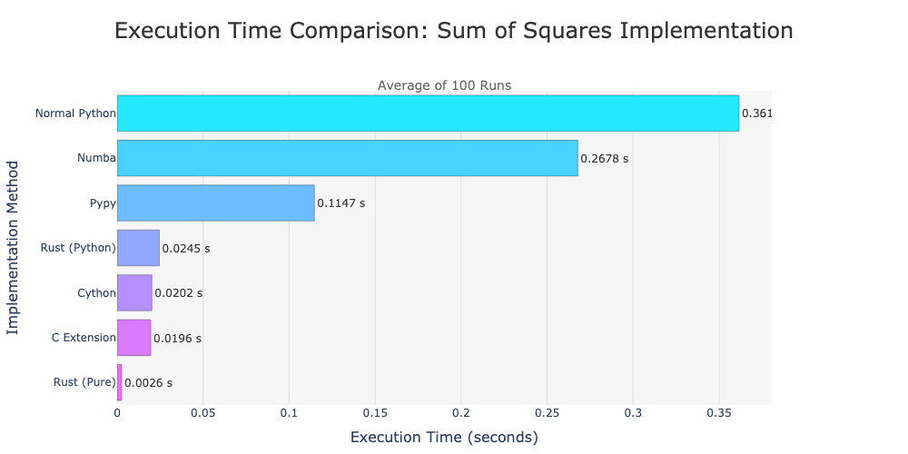
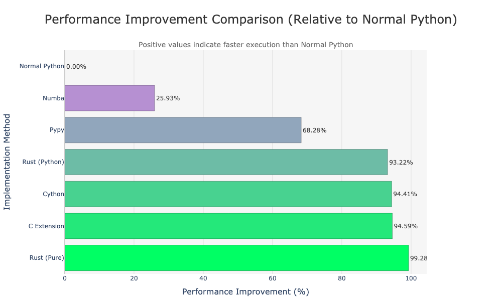

# Python Performance Comparison

This repository contains a set of benchmarks comparing the performance of different implementations of a computationally intensive task (sum of squares) using various methods including Normal Python, C Extension, Cython, Numba, and Rust. The benchmarks are run 100 times for each method, and the average execution times are calculated and visualized using Plotly.

## Project Structure

```plaintext
.
├── README.md
├── benchmark.py
├── c-ext
│   ├── c_ext_test.py
│   ├── setup.py
│   ├── sum_of_squares.c
│   └── sumofsquares.cpython-312-darwin.so
├── cython
│   ├── cython_test.py
│   ├── setup.py
│   ├── sum_of_squares.c
│   ├── sum_of_squares.cpython-312-darwin.so
│   └── sum_of_squares.pyx
├── execution_times_comparison.html
├── execution_times_comparison.png
├── numba
│   └── numba_test.py
├── performance_improvement_comparison.html
├── performance_improvement_comparison.png
├── poetry.lock
├── pyproject.toml
├── rust_pure
│   ├── Cargo.lock
│   ├── Cargo.toml
│   └── src
│       └── main.rs
├── rust_python
│   ├── Cargo.lock
│   ├── Cargo.toml
│   ├── rust_python_test.py
│   └── src
│       └── lib.rs
└── sum_of_squares.py
```

## Setup Instructions
### 1. Install Dependencies
Ensure you have the required dependencies installed for each implementation. You can install Python dependencies using poetry or pip.
```
poetry install
```

### 2. Compile C Extension
Navigate to the c-ext directory and compile the C extension.
```
cd c-ext
python setup.py build_ext --inplace
cd ..
```

### 3. Compile Cython Extension
Navigate to the cython directory and compile the Cython extension.
```
cd cython
python setup.py build_ext --inplace
cd ..
```

### 4. Compile Rust Projects
Ensure you have Rust installed. Compile the Rust projects.
```
# Rust Pure
cd rust_pure
cargo build --release
cd ..

# Rust Python
cd rust_python
maturin develop
cd ..
```

## Running the Benchmark
To run the benchmark and visualize the results, execute the benchmark.py script.
```python
python benchmark.py
```

This script will run the sum of squares computation 100 times for each method, calculate the average execution time, and generate an interactive Plotly bar chart comparing the performance of each method.

# Project Components
## 1. Normal Python
* File: sum_of_squares.py
* Description: Basic implementation of the sum of squares computation in Python.

## 2. C Extension
* Files: c-ext/c_ext_test.py, c-ext/sum_of_squares.c, c-ext/setup.py
* Description: C extension implementation for Python.

## 3. Cython
* Files: cython/cython_test.py, cython/sum_of_squares.pyx, cython/setup.py
* Description: Cython implementation for performance optimization.

## 4. Numba
* File: numba/numba_test.py
* Description: Numba JIT-compiled implementation for performance optimization.

## 5. Rust (Pure)
* Files: rust_pure/src/main.rs, rust_pure/Cargo.toml
* Description: Pure Rust implementation.

## 6. Rust (Python)
* Files: rust_python/src/lib.rs, rust_python/rust_python_test.py, rust_python/Cargo.toml
* Description: Rust implementation with Python bindings using PyO3.

# Visualizing Results
The `benchmark.py` script uses Plotly to generate an interactive bar chart comparing the average execution times of each method. The chart provides a clear visual representation of the performance differences, making it easy to identify the most efficient implementation.

## Execution Times Comparison


As shown in the chart, the Rust implementation (both pure and with Python bindings) outperforms all other methods, with the C extension and Cython implementations also providing significant performance improvements over the basic Python implementation.

## Performance Improvement Comparison


This chart illustrates the performance improvement of each method relative to the basic Python implementation. The Rust implementation (pure) offers the most significant improvement, followed by the C extension and Cython implementations. Numba and Rust binding also provide a notable performance boost, while the pure Python implementation lags behind the optimized methods.